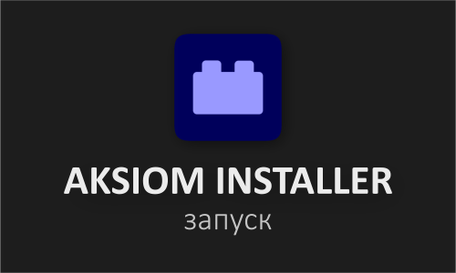

<div align="center">



# Aksiom AE Plugins Installer

**Автоматическая установка плагинов для Adobe After Effects в пару кликов**

[](https://github.com/Aks-iom/Aks-iom-AE-Plugins-install-script/releases)
[](LICENSE)
[](https://t.me/AE_plugins_script)
[](https://github.com/Aks-iom/Aks-iom-AE-Plugins-install-script/releases)

</div>

---

## О проекте

**Aksiom Installer** — это удобный графический инсталлятор, который автоматически скачивает и устанавливает популярные платные плагины для Adobe After Effects версий **2020–2025**.

Больше не нужно искать установщики по сайтам, разбираться в инструкциях и копировать файлы вручную — выбираешь нужные плагины, нажимаешь кнопку, готово.

---

## Поддерживаемые плагины

| Плагин | Версия | Размер |
|---|---|---|
| Red Giant (полный пакет) | 2026.3 | ~3.2 GB |
| Sapphire | 2026 | ~1.3 GB |
| BCC Continuum | 2026.0.1 | ~2.85 GB |
| Trapcode Suite | 2024.0 | ~970 MB |
| Magic Bullet Suite | 2024.0 | ~390 MB |
| Mocha Pro | 2026 | ~1.1 GB |
| Universe | 2024.0 | ~1.8 GB |
| Twixtor | 8.1.0 | ~200 MB |
| Element 3D | 2.2.3 | ~550 MB |
| Deep Glow | 1.6.6 | ~2 MB |
| Deep Glow 2 | 1.1 | ~5 MB |
| Saber | 1.0.40 | <1 MB |
| RSMB | 6.6.0 | 32.4 MB |
| Bokeh | 1.4.1 | ~8.5 MB |
| Flow | 1.5 | ~15 MB |
| Influx | 1.6.1 | 36 MB |
| Glitchify | 1.0 | <1 MB |
| Textevo 2 | 2.0 | 3 MB |
| Fxconsole | 1.0.5 | ~1.7 MB |
| Twich | 1.0.4 | <1 MB |
| Shake Generator | 1.0 | <1 MB |
| Fast Layers | 1.0 | <1 MB |
| Prime Tool | 1.0 | <1 MB |
| Uwu2x | 1.0 | <1 MB |

---

## Установка

### Способ 1 — готовый .exe (рекомендуется)

1. Перейди в раздел [Releases](https://github.com/Aks-iom/Aks-iom-AE-Plugins-install-script/releases)
2. Скачай последний `AksiomInstaller.exe`
3. Запусти от имени администратора
4. Выбери нужные плагины и нажми **Установить**

### Способ 2 — из исходников

```bash
# Клонировать репозиторий
git clone https://github.com/Aks-iom/Aks-iom-AE-Plugins-install-script.git
cd Aks-iom-AE-Plugins-install-script

# Установить зависимости
pip install -r requirements.txt

# Запустить
python main.py
```

**Требования:** Python 3.10+, PyQt6, Windows 10/11

---

## Как использовать

1. Запусти `AksiomInstaller.exe` от имени **администратора**
2. Выбери версию After Effects
3. Отметь нужные плагины галочками
4. Нажми **Установить** — программа сама скачает и установит всё

> Для работы необходимо подключение к интернету. Файлы загружаются с Google Drive.

---


## Контакты

- 📢 **Telegram-канал:** [AE Plugins Script](https://t.me/AE_plugins_script) — новости, обновления, релизы
- 💬 **Написать автору:** [@not_Aks](https://t.me/not_Aks)

---

## Лицензия

Распространяется под лицензией [MIT](LICENSE).

---

<div align="center">
  <sub>Сделано с ❤️ для AE-комьюнити • <a href="https://t.me/AE_plugins_script">Telegram</a></sub>
</div>
